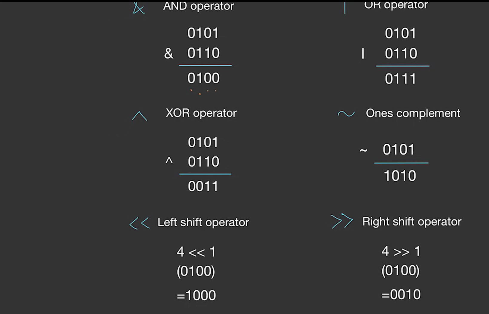
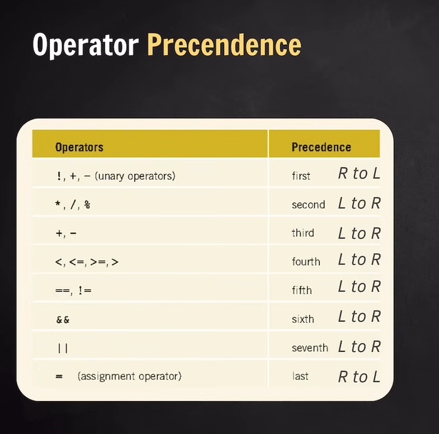

# **Operators in C++**

Operators are symbols that tell the compiler to perform specific operations on operands. 

An **operand** is the value on which the operator acts.  

**Arity** - How many operands use by an operator -> Unary, binary, ternary..

---

### **1. Types of Operators**
Operators can be classified into different categories:

#### **A. Arithmetic Operators**
These are used for basic mathematical operations:

| Operator | Description | Example |
|----------|------------|---------|
| `+` | Addition | `a + b` |
| `-` | Subtraction | `a - b` |
| `*` | Multiplication | `a * b` |
| `/` | Division (quotient) | `a / b` |
| `%` | Modulo (remainder) | `a % b` (works only on integers) |

**Example:**
```cpp
int a = 10, b = 3;
cout << a + b << endl;  // 13
cout << a - b << endl;  // 7
cout << a * b << endl;  // 30
cout << a / b << endl;  // 3 (Integer division)
cout << a % b << endl;  // 1
```
*Note:* The remainder in `%` takes the sign of the left operand.

---

#### **B. Relational (Comparison) Operators**
These operators compare two values and return **true (1)** or **false (0).**

| Operator | Meaning | Example |
|----------|------------|---------|
| `<`  | Less than | `a < b` |
| `>`  | Greater than | `a > b` |
| `<=` | Less than or equal to | `a <= b` |
| `>=` | Greater than or equal to | `a >= b` |
| `==` | Equal to | `a == b` |
| `!=` | Not equal to | `a != b` |

**Example:**
```cpp

int a = 5, b = 10;
cout << (a < b) << endl;  // 1 (true)
cout << (a > b) << endl;  // 0 (false)
cout << ( a<=b) << endl;  // 1 (true)
cout << ( a>=b) << endl;  // 0 (false)
cout << ( a==b) << endl;  // 0 (false)
cout << ( a!=b) << endl;  // 1 (true)

```

---

#### **C. Logical Operators**
Used for combining conditions.

| Operator | Meaning | Example |
|----------|------------|---------|
| `&&` | Logical AND (Both conditions must be true) | `(a < b) && (b > 5)` |
| `\|\|` | Logical OR (At least one condition must be true) | `(a > b) \|\| (b > 5)` |
| `!`  | Logical NOT (Reverses the condition) | `!(a == b)` |

**Example:**
```cpp
int a = 5, b = 10;
cout << (a < b && b > 5) << endl;  // 1 (true)
cout << (a > b || b > 5) << endl;  // 1 (true)
cout << !(a == b) << endl;  // 1 (true)
```

---

#### **D. Bitwise Operators**
Perform bit-level operations on integers.

| Operator | Name | Example |
|----------|------------|---------|
| `&` | Bitwise AND | `a & b` |
| `\|` | Bitwise OR | `a \| b` |
| `^` | Bitwise XOR | `a ^ b` |
| `~` | Bitwise NOT | `~a` |
| `<<` | Left Shift | `a << 2` (Multiplies by 2²) |
| `>>` | Right Shift | `a >> 2` (Divides by 2²) |

**Example:**
```cpp
int a = 5, b = 3;
cout << (a & b) << endl;  // 1
cout << (a | b) << endl;  // 7
cout << (a ^ b) << endl;  // 6
cout << (~ b) << endl;  // 
cout << (a << 1) << endl;  // 10  (5 * 2)
cout << (a >> 1) << endl;  // 2  (5 / 2)
```


**Explanation:**


---

#### **E. Assignment Operators**
Used to assign values to variables.

| Operator | Meaning | Example |
|----------|------------|---------|
| `=` | Assign | `a = 5` |
| `+=` | Add and assign | `a += 5` (same as `a = a + 5`) |
| `-=` | Subtract and assign | `a -= 5` |
| `*=` | Multiply and assign | `a *= 5` |
| `/=` | Divide and assign | `a /= 5` |
| `%=` | Modulo and assign | `a %= 5` |

---
    

#### **F. Unary Operators**
Operators that work on a single operand.

| Operator | Meaning | Example |
|----------|------------|---------|
| `++` | Increment | `++a` (pre-increment), `a++` (post-increment) |
| `--` | Decrement | `--a` (pre-decrement),`a--` (post-decrement) |

**Example:**
```cpp
int a = 5;
cout << a++ << endl;  // 5 (post-increment: prints first, then increments)
cout << a << endl;  // 6

a = 5;
cout << ++a << endl;  // 6 (pre-increment: increments first, then prints)

a = 5;
cout << a-- << endl;  // 5 (post-decrement: prints first, then decrement)
cout << a << endl;  //4

a=5;
cout << --a << endl;  // 4 (pre-decrement: decrement first, then prints)
```

---

#### **G. Ternary Operator (`?:`)**
A shortcut for `if-else`.

**Syntax:**
```cpp
(condition) ? value_if_true : value_if_false;
```

**Example:**
```cpp
int a = 10, b = 20;
int max = (a > b) ? a : b;
cout << "Maximum is " << max << endl;  // 20
```

---

#### **H. Special Operators**
| Operator | Meaning | Example |
|----------|------------|---------|
| `sizeof` | Returns size of a data type in bytes | `sizeof(int)` |
| `&` | Address-of operator | `&a` (returns memory address of `a`) |
| `*` | Dereference operator | `*ptr` (access value at pointer) |
| `new` | Allocates memory | `int *p = new int;` |
| `delete` | Deallocates memory | `delete p;` |
| `,` | Comma operator | `a = (b = 2, b + 3);` |
| `::` | Scope resolution | `::a` (access global variable `a`) |

**Example:**
```cpp

int a = 10;
cout << "Size of int: " << sizeof(a) << " bytes" << endl;

```

---

### **Operator Precedence**
Operators have different levels of precedence. Higher precedence means they execute first.




> For detail precedence chart refere another image present in the same folder

**Example:**
```cpp
int a = 10, b = 5, c = 2;
int result = a + b * c;  // Multiplication happens first, then addition
cout << result;  // 20
```

---

### **Summary**
- Operators are used to perform operations on variables.
- Arithmetic, Logical, Relational, Bitwise, Assignment, and Special Operators are used based on requirements.
- **Operator precedence** determines the execution order.
